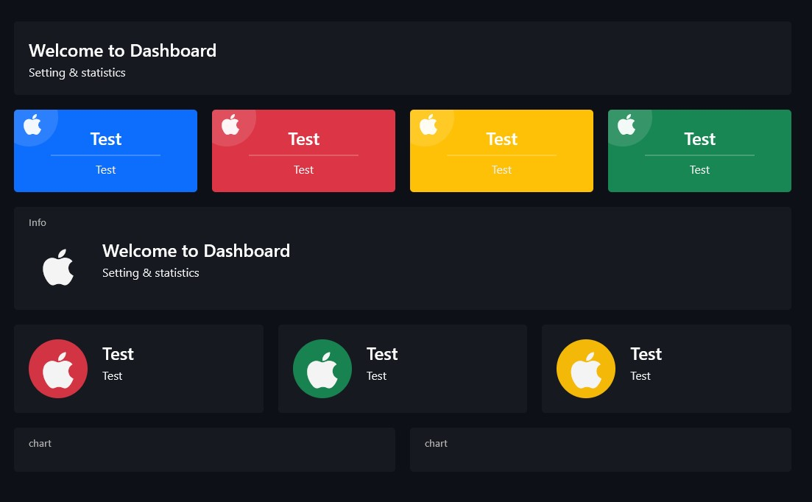

# Panels UI
### creative and simple bootstrap for creating panel based menu and dashboards

# Geting started
To create layout for panels just use "layout" class
```
<div class="layout">
...
</div>
```
There are 2 directions for blocks
```
<div class="horizontal" />
<div class="vertical" />
```
And the main class "block"
```
<div class="block" />
```
## Block options
### Color
4 different colors: blue, yellow, red, green
```
<div class="block blue" />
<div class="block yellow" />
<div class="block red" />
<div class="block green" />
```
### Label
Labals extend block height automaticaly whether attribute exists or not empty
```
<div class="block green" label="test" />
//extended block

<div class="block green" />
//default block
```

# Block content
# Icon
To put icon in block just wrap span with "icon" class 
```
<div class="icon">
  <span>...</span>
</div>
```
## Icon Options
### Corner
Anchor icon to upper-left corner
```
<div class="icon corner">
  <span>...</span>
</div>
```
### Color
You can apply color on icon background as block
```
<div class="icon blue">
  <span>...</span>
</div>
```
#Text
All content wrapped inside "wrapper" class
```
<div class="wrapper">
...
</div>
```
## Wrapper options
### Alignment
To center all text
```
<div class="wrapper center">
...
</div>
```
### Color
Same as for block
```
<div class="wrapper blue">
...
</div>
```
# Wrapper content
## Topic
Huge text
```
<div class="wrapper">
  <div class="topic">Test</div>
  ...
</div>
```
## Spacer
Divider between content
```
<div class="wrapper">
  ...
  <div class="spacer"></div>
  ...
</div>
```
## Description
Smaller text than topic
```
<div class="wrapper">
  ...
  <div class="description">Test</div>
</div>
```

All content allign automaticaly with options chosen


